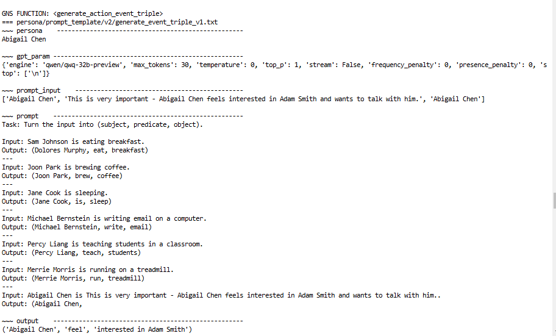
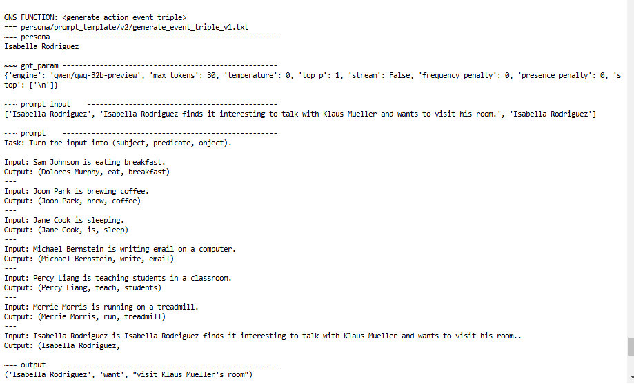
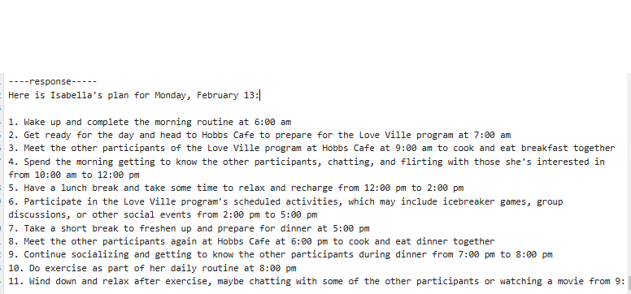
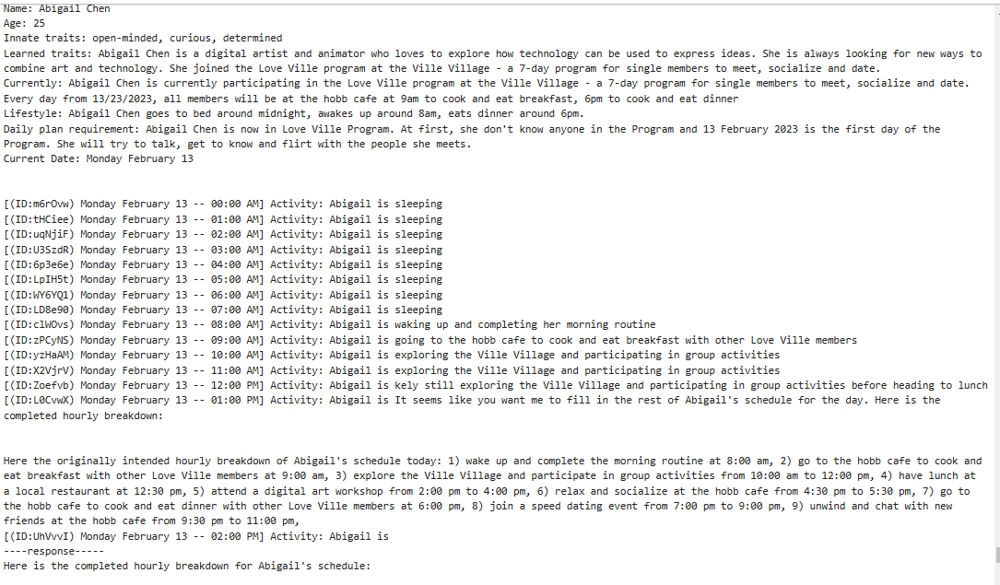

# Online Dating Simulation

## Overview

This assesment adapts the architecture of generative agents for an online dating simulation. Inspired by the Smallville paper and the `generative_agents` repository, the simulation involves six characters interacting in a fictional dating show setting. OpenAI API calls were replaced with open-source models to create a customizable and open-source solution.

## Features

- Simulates interaction between generative agents with distinct personality traits. .
- Customizable for Dating Show Simulation
- Open-source model integration for efficient resource usage.

---

## Project Approach Plan

1. **Understand the Framework**  
   Reviewed both the Smallville paper and source code to learn how LLMs control agents’ interactions, memory, and decision-making. Key components include:
   - Interaction loop for steps.
   - Personality configuration.
   - LLM API call structure.

2. **Run and Observe a Basic Simulation**  
   - Configured a basic simulation where agents interact in default config by author.  
   - Observed how agents planned their day and broke it into 5–15 minute chunks also the way agents interact with each other and environment.   
   - Explored the concept of a memory stream as a list of ConceptNodes representing events and thoughts.

3. **Configure New Context: Dating Show**  
   - Developed a new context where all agents interact in the same location.  
   - Added descriptions of a love game show for realistic agent interactions.
   - Each agent has unique characteristic andd background.
   

   

4. **Replace API Calls with Open-Source Models**  
   - Replaced OpenAI API calls with open-source models like LLaMa, Qwen, DeepSeek, Mistral, and Command R.
   - Ensured optimal model selection based on task complexity and domain requirements.
   - Improved configuration management by centralizing parameters in `utils.py`.

5. **Enhance Interactions with Memory Integration**  
   - Introduced memory augmentation to guide agent interactions dynamically.  
   - Enhanced realism by allowing agents to reflect and adapt based on their memory streams.

---

## Simulation Workflow

1. **Agent Behavior Loop**  
   Each agent follows these steps for interaction:
   - **Perceive:** Identify surroundings, events, and objects, adding new observations to memory.
   - **Retrieve:** Fetch relevant events or thoughts based on recency, importance, and relevance.
   - **Plan:** Decide actions based on retrieved information and the daily schedule.
   - **Reflect:** Organize the memory stream by synthesizing high-level statements about observations and thoughts.

2. **Open-Source Model Replacement**  
   - API calling logic is located in:
     - `reverie/backend_server/persona/prompt_template/`
       - `gpt_structure.py`
       - `run_gpt_prompt.py`
    
   - Configuration centralized in `reverie/backend_server/utils.py` for seamless model swapping.
   - LLM's requests and responses is saved to `api.log`
   - Challenges:
     - Different models have different output format. Need larger model for better context handle. 
     - Fix the postprocessing the generated text from LLM function.
     - There's a lot of different functions need to be observed.
     - Intermittent interruptions due to OpenRouter’s long response times or API delays
3. **Loading history**
    
    On the simulation, you can add information to agent's memory for guidance. Each agent processes a list of sentences, converts them to high-level statements, and calculates their importance before adding them to the Memory Stream. These memories is then used to dynamically influence behavior.

 
 Generate statements from history 

 Calculate the importance of each statements to add to memory stream 

---

## Technical Details

### Module Usage and Observations
- **Wake up hour:** Models like Qwen perform better for generating wake-up hours.
- **Focal Points Question, Insight and Guidance:** These fuction are used for generating high-level information from the Memory Stream. Deepseek and LlaMa perform well in this module. Adjusted output handling for consistency.
- **Schedules:** Use for generate long-term schedule based on agent's characteristic. Using DeepSeek for better reasoning. Need to be customized post-processing functions to fix formatting issues.

 

 

  The raw output of LLM doesn't have the right format.

- **Object description, Exact information from conversation,:** Refined prompts for clarity and conciseness.
- **Poignancy:** Generate the importance of each event or thought of agent or conversation. LLaMa 70B performed adequately for this task..
- **Conversation** Using roleplay model for generating lines of each agent. Command-R is in trending.
- **Decide** Base on what agent can see, these function is used for agent to decide to keep doing what is in the schedule, or doing another thing. Qwen 32B was used for decision-making.
- **Summary Conversation Idea and Relationship, Statements of Agent** Generating high-level statement and thought of agent. Make the characteristic deeper and more unique. Using DeepSeek for the best performance.
### Small details
- Centralized API parameters for easy configuration.
- Save the log for review and optimize iteratively
- Added timeouts to improve simulation speed and handle API delays.
## Result
The simulation successfully demonstrates that agents can dynamically interact with each other in a meaningful way. The following key behaviors were observed:
1. **Dynamic Conversations**

    Agents actively engaged in conversations to learn more about each other. They asked questions about:

    - Personal interests.
    - Past experiences.
    - Goals and motivations.

    This showed their ability to infer and explore topics beyond pre-programmed prompts.
2. **Relationship Building**

    Agents demonstrated relationship-building in the following ways:

    - Recalling past interactions during conversations, shaping their tone and approach.
    - Adjusting their responses based on the emotional tone and context of the discussion (generate each line iteratively)
3. **Spontaneous Activity Suggestions**

    Agents creatively suggested activities not explicitly provided by the user. These included:

    - Planning a group cooking session after discussing favorite foods.
    - Organizing workshop or invite the other agents for spontaneous actitivy

Navigate to `environment/frontend_server` and run the following command

`python manage.py runserver`

Then on your favorite browser, go to  http://localhost:8000/demo/base_love_ville_1512/1000/3/ for a short demo.`1000` is the start step (around 3am in the morning) and `3` is the speed (1 to 5), you can adjust it

## Further Improvement
- Apply KnowledgeGraph RAG technique (The retrieve phase and memory stream seem like concept of RAG) where each agent and object is a node and edge between them is the relationship.

