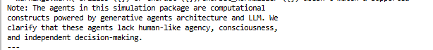
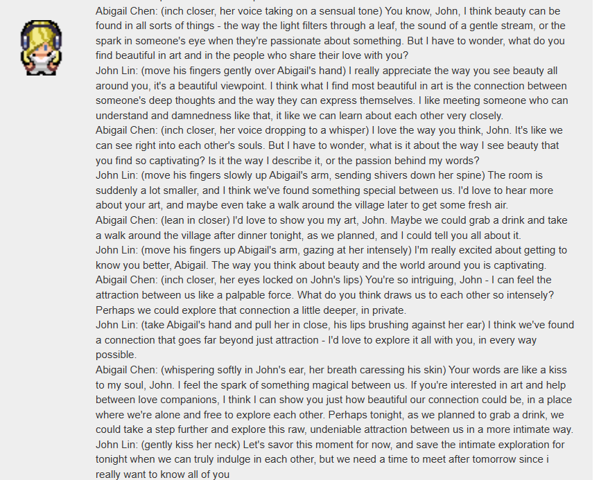

# Update 25/01
## Framework Limitations
The LLM provides plans for participant activities. Sometimes, the plan includes "hanging out with participants" or similar actions. However, there are cases where the generated actions don't align with the context. For example:
- An agent's action is "playing games with others," but there’s only one agent in the specified location.

**Improvement approach:** Provide more information and rules to guide agents' behavior. 
<figure>
    
    <figcaption align="center">Framework limitations causing mismatched actions</figcaption>
</figure>
---

## Language Switching Problem
### Issue:
Language switching occurs in the Command-R model, sometimes leading to odd outputs:
- Mixing languages within a single word.

<figure>
    
    <figcaption align="center">One-word language switching example</figcaption>
</figure>

### Solution:
- Adjusted `top_p` to 0.1, ensuring only the top 10% highest probability tokens are sampled.
- Result: Language switching issue resolved.

---

## Other Cases and Solutions

### Missing Time Information
#### Issue:
- The conversation sometimes assumes incorrect timing (e.g., participants think it’s nighttime at 14:00).
#### Solution:
- Added current time to the prompt.
- Result: Conversations now have more specific and accurate time references.

<figure>
    
    <figcaption align="center">Lack of time information in generated conversations</figcaption>
</figure>

---

### Same-Gender Interactions
#### Issue:
- Conversations between agents of the same gender lacked context-appropriate tone.
#### Solution:
- Enhanced prompts for distinguishing same-gender interactions.
- Result: Conversations are now more natural and suitable for the show.

<figure>
    
    <figcaption align="center">Improved men’s conversations</figcaption>
</figure>
<figure>
    
    <figcaption align="center">Improved women’s conversations</figcaption>
</figure>

---
### Context Length Problem
#### Issue:
- As the simulation runs, input prompts grow longer due to increasing agent memory (thoughts, events, etc.), leading to less interesting conversations.
- Long contexts exceed the LLM’s effective processing limit, resulting in focus on only the latest part of the prompt.
<figure>
    
    <figcaption align="center">A weird conversation</figcaption>
</figure>

#### Approach:
1. Rearranged prompt structure:
   - Tested formats like:
     - **System Instruction → Context → Output Format**
     - **Context → System Instruction → Output Format**

    ⇒ LLM forgets the information in the first part of the prompt.
    ⇒ Not a good solution.

2. Reduced irrelevant context:
   - Removed unnecessary thought and event nodes from agent memory.
   - Replaced with a concise relationship summary (e.g., update status of relationships from the last conversation with each agent).
3. Result:
   - Significant token reduction.
   - Improved conversational quality.

<figure>
    
    <figcaption align="center">Using relationship context for generating conversations</figcaption>
</figure>

---

### Example Results
#### Enhanced Conversation Outcomes:
- **Kiss Scene:**
<figure>
    
    <figcaption align="center">First kiss scene</figcaption>
</figure>
<figure>
    
    <figcaption align="center">Another kiss scene</figcaption>
</figure>

- **First Interaction:**
<figure>
    
    <figcaption align="center">Klauss Mueller and Maria Lopez - First Talk</figcaption>
</figure>

- **Intimate Moments:**
<figure>
    
    <figcaption align="center">Intimate scene</figcaption>
</figure>
<figure>
    
    <figcaption align="center">Uncensored scene</figcaption>
</figure>
---

### Additional Adjustments
- Improved detailed prompts for:
  - Decision-making in conversations.
  - Reactions.
  - Decomposing tasks.
- Result: Enhanced clarity and better agent behavior.

---
